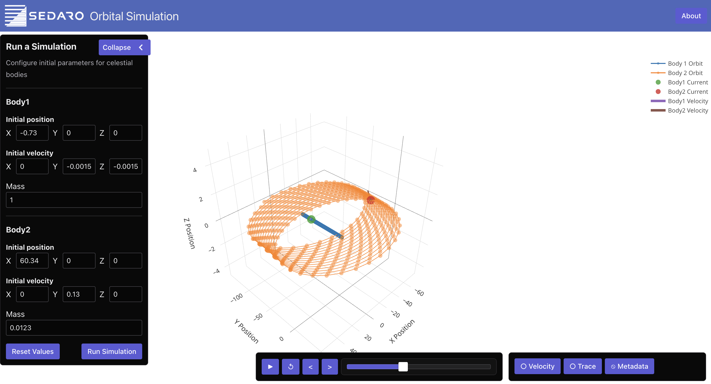
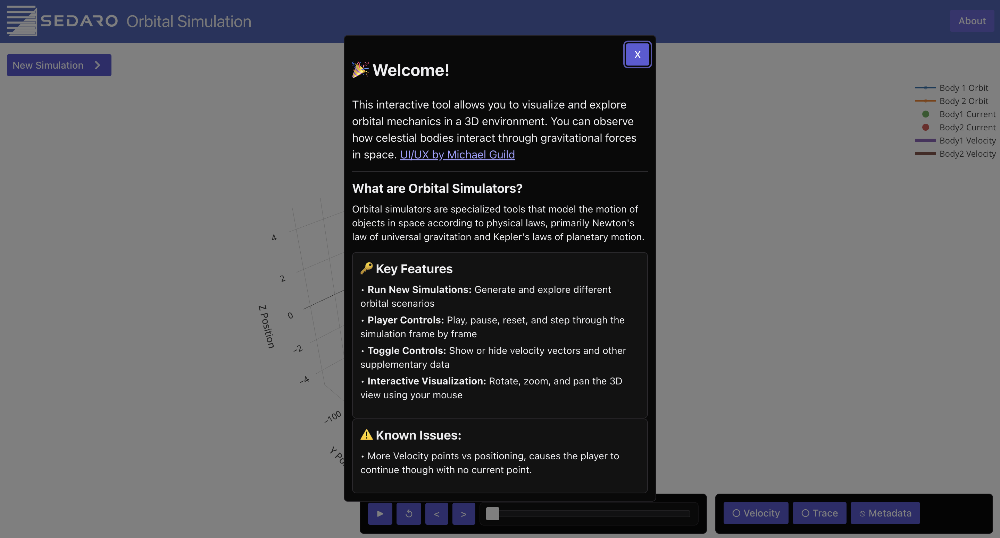
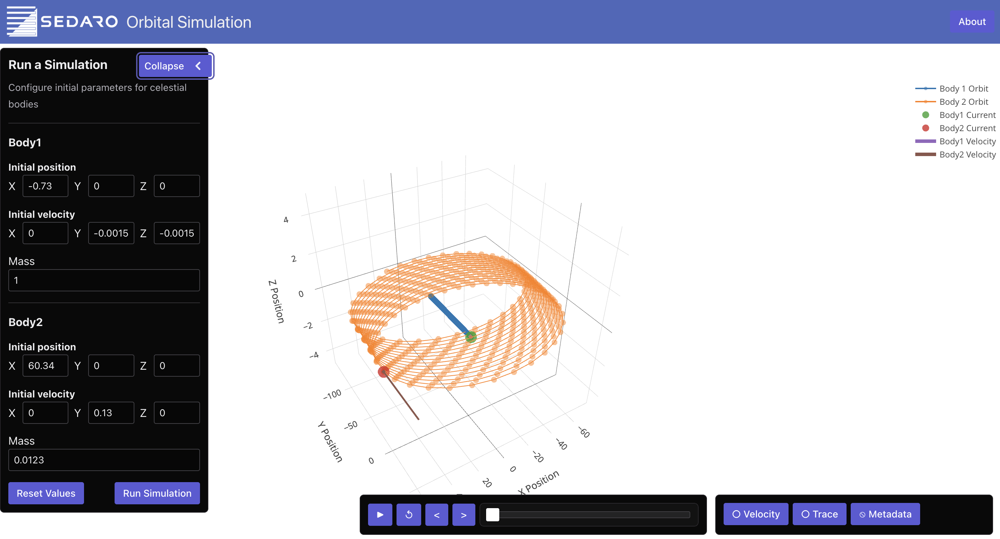

## Goal
The goal of this mini-project is to gain a better understanding of your ability to **be creative**, **think through problems**, and **solve relevant challenges** related to the engineering roles at Sedaro. This is an opportunity for you to show off your personal strengths. Don't focus on the simple contributions and instead aim to really impress us.

Submissions are evaluated on whether they are job-relevant, meet the title level, make the product better, keep a high quality bar, and are clearly and concisely explained in the write-up. The project is due within **7 days** of receipt and we expect you to spend no more than **6 hours** on it.

#### Frontend/full-stack
- Revamp the UI/UX with cool visualizations and interactivity
- Live-stream the simulation
- Show off your best creative work with a redesign

## My Submission
I submitted my coding zipped version of this coding challenge with including this document explaining my process from analyzing, ideation, and execution:
[Goggle Documentation](https://docs.google.com/document/d/1XZ0NaYre3RTrhkt4rfE0-t09NRVgFA3Te9O2y0z4AWA/edit?usp=sharing)

## Setup
1. Clone this repository.
   - Please note that **only** cloning via HTTPS is supported
   - Please **do not** commit changes to any branch of this repository. If you would like to use git, you may fork this repository to create a private repo of your own
2. Ensure that Docker is installed and running. To compile and run the app, execute the following command
   - `docker compose up --build`
   - Ensure your localhost ports `3030` and `8000` are available first.
3. That's it ✅! Sedaro Nano should now be available via web browser at http://localhost:3030/. The API is running at http://localhost:8000/.
   - It may take a few moments for the container to fully come up and serve the page.
   - Changes to both the React app and the Flask app should auto reload.
